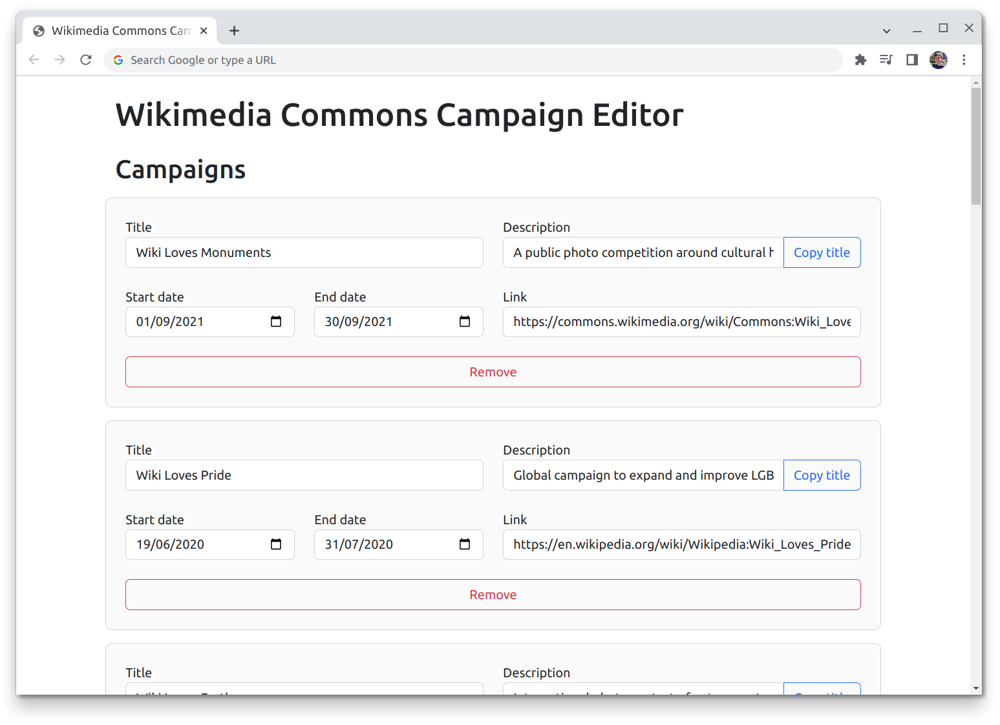
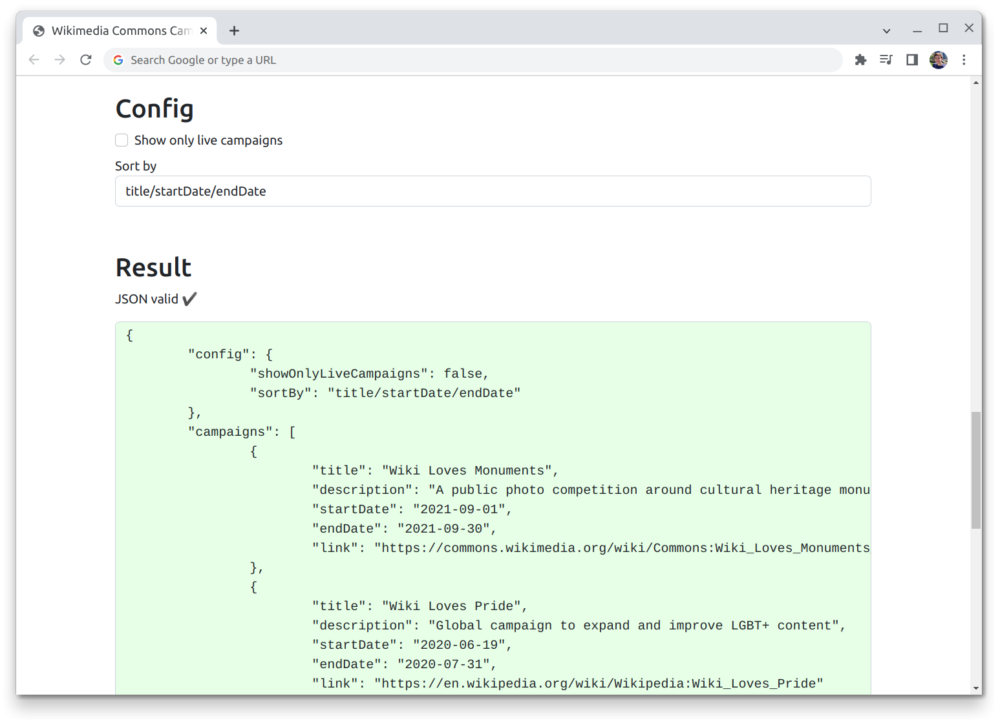

# Wikimedia Commons Campaigns Editor

## **[Start editing in your browser now](https://commons-app.github.io/campaigns-editor/)**

This web application allows you to edit Wikimedia campagins that are displayed in the Wikimedia Commons apps.

See [the campaigns repo](https://github.com/commons-app/campaigns) for usage instructions and more information.
